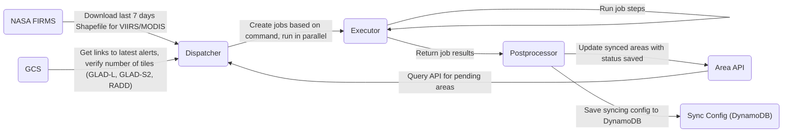

# datapump

An AWS Step Function for ingesting data or reading data from the gfw-data-api, running some analysis on it, and then uploading the results to the gfw-data-api. Currently mainly focused of geotrellis-based zonal statistics using gfw_forest_loss_geotrellis.

### Commands

Different workflows can be triggered by submitting different JSON commands. Currently supported commands:

#### Analysis Command

This will run a supported analysis on a dataset version in the gfw-data-api, and automatically upload results back to the gfw-data-api.

```json
{
  "command": "analysis",
  "parameters": {
    "analysis_version": "Versioning for analysis run (e.g. v2020Q4)",
    "sync": "Whether or not to include when syncing results after ingesting new data. See Sync Command below.",
    "geotrellis_version":  "Version of geotrellis jar to use, if running a geotrellis analysis",
    "tables": [
      {
        "dataset": "Valid dataset on gfw-data-api",
        "version": "Valid version of above dataset. Must have a 1x1 grid asset if doing geotrellis analysis.",
        "analysis": "Analysis to perform. Must be one of [tcl, glad, viirs, modis]."
      },
      ...
    ]
  }
}
```

#### Sync Command

This will attempt to ingest new data for each listed sync type, and will update appropriate analyses if sync was set to true when they were created.

```json
{
  "command": "sync",
  "parameters": {
    "types": ["List of sync types to run, must be from [viirs, modis, glad, rw_areas]"],
    "sync_version": "Version to use to indicate which sync this is from. If empty, will by default use vYYYYMMDD based on the current date."
  }
}
```

### Architecture

We use AWS Step Functions and AWS Lambdas to orchestrate the pipeline. We pull fire alerts data from NASA FIRMS, deforestation data from Google Cloud Storage (GCS), and user area data from the ResourceWatch Areas API.



There are three lambdas:
**Dispatcher**: This lambda is the entrypoint and takes in the command. It creates the jobs to run based on the commands. For `sync` jobs, it will reach out to the different data providers (NASA, GCS, RW) and sync any required data to run the jobs.

**Executor**: This lambda will execute each job. There are different classes in the `datapump` module that define how to reach each job. This is generally a multiple step process, like uploading data to the Data API, running EMR jobs or creating tile caches.

**Postprocessor**: Once the jobs are complete, this will do any post-job work depending on the type of job and its parameters. If an `analysis` job was to set sync, it will add an entry to the DynamoDB table with the info neccessary to sync new data every night. This is typically the dataset and version the analysis is run on, the version of the dataset to sync to, any additional data like the geotrellis jar used, and a flag on whether to keep syncing. The primary key is a hash of these fields. For syncing user areas, the postprocessor will also update the RW Areas API with the status "saved" for any area that was processed. This lets GFW know results are ready for the area.
